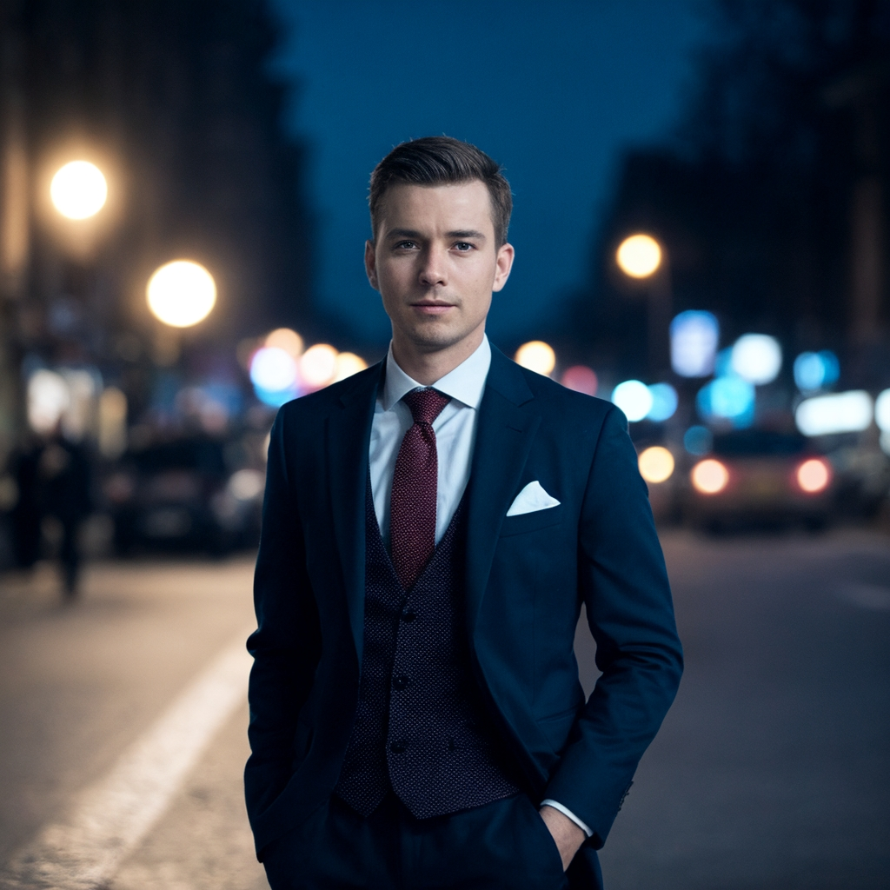

# SD Webui Vectorscope CC
This is an Extension for the [Automatic1111 Webui](https://github.com/AUTOMATIC1111/stable-diffusion-webui), which performs a kind of **Offset Noise** natively,
allowing you to adjust the brightness, contrast, and color of the generations.

> Also compatible with [Forge](https://github.com/lllyasviel/stable-diffusion-webui-forge)!

> Now supports SDXL!

> [Sample Images](#sample-images)

## How to Use
After installing this Extension, you will see a new section in both **txt2img** and **img2img** tabs. 
Refer to the parameters and sample images below and play around with the values.

**Note:** Since this modifies the underlying latent noise, the composition may change drastically.

#### Parameters
- **Enable:** Turn on/off this Extension
- **Alt:** Modify an alternative Tensor instead, causing the effects to be significantly stronger
- **Brightness:** Adjust the overall brightness of the image
- **Contrast:** Adjust the overall contrast of the image
- **Saturation:** Adjust the overall saturation of the image

#### Color Channels
- Comes with a Color Wheel for visualization
- You can also click and drag on the Color Wheel to select a color directly

<table>
    <thead align="center">
        <tr>
            <td><b>Channel</b></td>
            <td><b>Lower</b></td>
            <td><b>Higher</b></td>
        </tr>
    </thead>
    <tbody align="center">
        <tr>
            <td><b>R</b></td>
            <td>Cyan</td>
            <td>Red</td>
        </tr>
        <tr>
            <td><b>G</b></td>
            <td>Magenta</td>
            <td>Green</td>
        </tr>
        <tr>
            <td><b>B</b></td>
            <td>Yellow</td>
            <td>Blue</td>
        </tr>
    </tbody>
</table>

#### Buttons
- **Reset:** Reset all settings to the default values
- **Randomize:** Randomize `Brightness`, `Contrast`, `Saturation`, `R`, `G`, `B`

#### Style Presets
- Use the `Dropdown` to select a Style then click **Apply Style** to apply
- To save a Style, enter a name in the `Textbox` then click **Save Style**
- To delete a Style, enter the name in the `Textbox` then click **Delete Style**
    - *Deleted Style is still in the `styles.json` in case you wish to retrieve it*
- Click **Refresh Style** to update the `Dropdown` if you edited the `styles.json` manually

#### Advanced Settings
- **Process Hires. fix:** By default, this Extension only functions during the **txt2img** phase, so that **Hires. fix** may "fix" the artifacts introduced during **txt2img**. Enable this to process **Hires. fix** phase too.
  - This option does not affect **img2img**

#### Noise Settings
> let `x` denote the Tensor ; let `y` denote the operations

- **Straight:** All operations are calculated on the same Tensor
  - `x += x * y`
- **Cross:** All operations are calculated on the Tensor opposite of the `Alt.` setting
  - `x += x' * y`
- **Ones:** All operations are calculated on a Tensor filled with ones 
  - `x += 1 * y` 
- **N.Random:** All operations are calculated on a Tensor filled with random values from normal distribution 
  - `x += randn() * y`
- **U.Random:** All operations are calculated on a Tensor filled with random values from uniform distribution
  - `x += rand() * y`
- **Multi-Res:** All operations are calculated on a Tensor generated with multi-res noise algorithm
  - `x += multires() * y`
- **Abs:** Calculate using the absolute values of the chosen Tensors instead
  - `x += abs(F) * y`

#### Scaling Settings
By default, this Extension offsets the noise by the same amount each step.
But due to the denoising process, this may produce undesired outcomes such as blurriness at high **Brightness** or noises at low **Brightness**.
Therefore, I added a scaling option to modify the offset amount throughout the process.

> Essentially, the "magnitude" of the default Tensor gets smaller every step, so offsetting by the same amount will have stronger effects at the later steps.

- **Flat:** Default behavior. Same amount each step.
- **Cos:** Cosine scaling. *(High -> Low)*
- **Sin:** Sine scaling. *(Low -> High)*
- **1 - Cos:** *(Low -> High)*
- **1 - Sin:** *(High -> Low)*

## Sample Images
- **Checkpoint:** [Animagine XL V3](https://civitai.com/models/260267)
- **Pos. Prompt:** `[high quality, best quality], 1girl, solo, casual, night, street, city, <lora:SDXL_Lightning_8steps:1>`
- **Neg. Prompt:** `lowres, [low quality, worst quality], jpeg`
- `Euler A SGMUniform`; `10 steps`; `2.0 CFG`; **Seed:** `2836968120`
- `Multi-Res Abs.` ; `Cos`

<code>Disabled</code> 

<code>Brightness: 2.0 ; Contrast: -0.5 ; Saturation: 1.5 
R: 2.5; G: 1.5; B: -3</code> 

<code>Brightness: -2.5 ; Contrast: 1 ; Saturation: 0.75 
R: -1.5; G: -1.5; B: 4</code> 

## Roadmap
- [X] Extension Released
- [X] Add Support for **X/Y/Z Plot**
- [X] Implement different **Noise** functions
- [X] Add **Randomize** button
- [X] **Style** Presets
- [X] Implement **Color Wheel** & **Color Picker**
- [X] Implement better scaling algorithms
- [X] Add API Docs
- [X] Append Parameters onto Metadata
  - You can enable this in the **Infotext** section of the **Settings** tab
- [X] Add Infotext Support *(by. [catboxanon](https://github.com/catboxanon))*
- [X] ADD **HDR** Script
- [X] Add SDXL Support
- [ ] Add Gradient features

<code>X/Y/Z Plot Support</code> 

<code>Randomize</code> 
 
The value is used as the random seed You can refer to the console to see the randomized values

## API
You can use this Extension via [API](https://github.com/AUTOMATIC1111/stable-diffusion-webui/wiki/API) by adding an entry to the `alwayson_scripts` of your payload. 
An [example](samples/api_example.json) is provided.
The `args` are sent in the following order in an `array`:

- **Enable:** `bool`
- **Alt:** `bool`
- **Brightness:** `float`
- **Contrast:** `float`
- **Saturation:** `float`
- **R:** `float`
- **G:** `float`
- **B:** `float`
- **Process Hires. Fix:** `bool`
- **Noise Settings:** `str`
- **Scaling Settings:** `str`

## Known Issues
- Does **not** work with `DDIM`, `UniPC`, `Euler` samplers
- Has little effect when used with certain **LoRA**s

## HDR

<i><b>BETA</b></i>

> [Discussion Thread](https://github.com/Haoming02/sd-webui-vectorscope-cc/issues/16)

- In the **Script** `Dropdown` at the bottom, there is now a new option: **`High Dynamic Range`**
- This script will generate multiple images *("Brackets")* of varying brightness, then merge them into 1 HDR image
- *Do provide feedback in the thread!*
- **Highly Recommended** to use a deterministic sampler and high enough steps. `Euler` *(**not** `Euler a`)* worked well in my experience.

#### Settings
- **Brackets:** The numer of images to generate
- **Gaps:** The brightness difference between each image
- **Automatically Merge:** When enabled, this will merge the images using an `OpenCV` algorithm and save to the `HDR` folder in the `outputs` folder; When disabled, this will return all images to the result section, for when you have a more advanced program such as Photoshop to do the merging.
  - All the images are still saved to the `outputs` folder regardless

Offset Noise TL;DR

The most common *version* of **Offset Noise** you may have heard of is from this [blog post](https://www.crosslabs.org/blog/diffusion-with-offset-noise), 
where it was discovered that the noise functions used during **training** were flawed, causing `Stable Diffusion` to always generate images with an average of `0.5` *(**ie.** grey)*.

> **ie.** Even if you prompt for dark/night or bright/snow, the overall image still looks "grey"

> [Technical Explanations](https://youtu.be/cVxQmbf3q7Q)

However, this Extension instead tries to offset the latent noise during the **inference** phase. 
Therefore, you do not need to use models that were specially trained, as this can work on any model.

How does this work?

After reading through and messing around with the code, 
I found out that it is possible to directly modify the Tensors 
representing the latent noise used by the Stable Diffusion process.

The dimensions of the Tensors is `(X, 4, H / 8, W / 8)`, which can be thought of like this:

> **X** batch of noise images, with **4** channels, each with **(W / 8) x (H / 8)** values

> **eg.** Generating a single 512x768 image will create a Tensor of size (1, 4, 96, 64)

Then, I tried to play around with the values of each channel and ended up discovering these relationships.
Essentially, the 4 channels correspond to the **CMYK** color format, 
hence why you can control the brightness as well as the colors.

#### Vectorscope?
The Extension is named this way because the color interactions remind me of the `Vectorscope` found in **Premiere Pro**'s **Lumetri Color**.
Those who are experienced in Color Correction should be rather familiar with this Extension.

~~Yes. I'm aware that it's just how digital colors work in general.~~

~~We've come full **circle** *(\*ba dum tss)* now that a Color Wheel is actually added.~~
