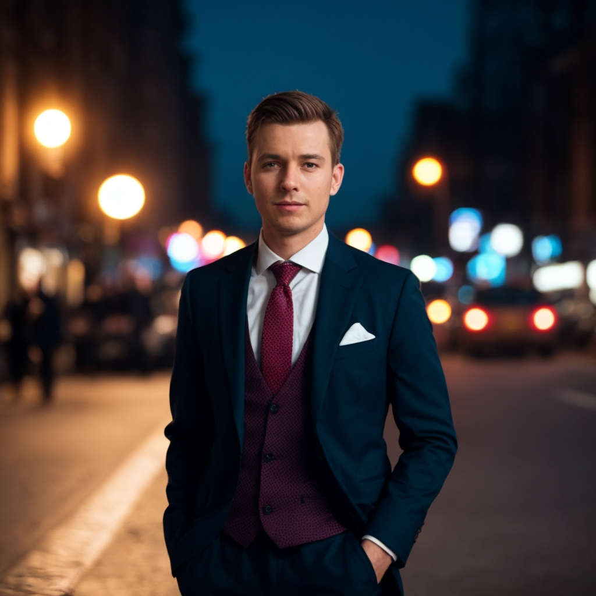
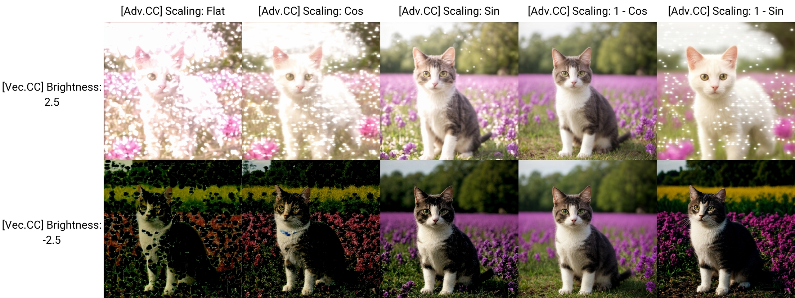

# SD Webui Vectorscope CC
This is an Extension for the [Automatic1111 Webui](https://github.com/AUTOMATIC1111/stable-diffusion-webui), which performs a kind of **Offset Noise** natively during inference, allowing you to adjust the brightness, contrast, and color of the generations.

> Also supports both old & new [Forge](https://github.com/lllyasviel/stable-diffusion-webui-forge)

## Example Images

<p align="center">
<br>
<code>Base Image w/o Extension</code>
</p>

<details>
<summary>Infotext</summary>

- **Checkpoint:** [realisticVisionV51](https://civitai.com/models/4201?modelVersionId=130072)
- **Positive Prompt:** `(high quality, best quality), a 4k cinematic photo of a gentleman in suit, street in a city at night, (depth of field, bokeh)`
- **Negative Prompt:** `(low quality, worst quality:1.2), [EasyNegative, EasyNegativeV2]`

```cpp
Steps: 32, Sampler: DPM++ 2M Karras, CFG scale: 7.5, Seed: 3709157017, Size: 512x512, Denoising strength: 0.5
Clip skip: 2, Token merging ratio: 0.2, Token merging ratio hr: 0.2, RNG: CPU, NGMS: 4
Hires upscale: 2, Hires steps: 16, Hires upscaler: 2xNomosUni_esrgan_multijpg
```

</details>

<table>
    <thead>
        <tr align="center">
            <td><b>Vibrant</b></td>
            <td><b>Cold</b></td>
            <td><b>"Movie when Mexico"</b></td>
        </tr>
    </thead>
    <tbody>
        <tr align="center">
            <td></td>
            <td></td>
            <td></td>
        </tr>
        <tr align="left">
            <td>
                <ul>
                    <li><b>Alt:</b> <code>True</code></li>
                    <li><b>Saturation:</b> <code>1.75</code></li>
                    <li><b>Noise:</b> <code>Ones</code></li>
                    <li><b>Scaling:</b> <code>1 - Cos</code></li>
                </ul>
            </td>
            <td>
                <ul>
                    <li><b>Brightness:</b> <code>-5.0</code></li>
                    <li><b>Contrast:</b> <code>2.5</code></li>
                    <li><b>Saturation:</b> <code>0.75</code></li>
                    <li><b>R:</b> <code>-3.0</code></li>
                    <li><b>B:</b> <code>3.0</code></li>
                    <li><b>Noise:</b> <code>Ones</code></li>
                    <li><b>Scaling:</b> <code>1 - Sin</code></li>
                </ul>
            </td>
            <td>
                <ul>
                    <li><b>Brightness:</b> <code>2.5</code></li>
                    <li><b>Contrast:</b> <code>-2.5</code></li>
                    <li><b>Saturation:</b> <code>1.25</code></li>
                    <li><b>R:</b> <code>1.5</code></li>
                    <li><b>G:</b> <code>3.0</code></li>
                    <li><b>B:</b> <code>-4.0</code></li>
                    <li><b>Noise:</b> <code>Ones</code></li>
                    <li><b>Scaling:</b> <code>1 - Sin</code></li>
                </ul>
            </td>
        </tr>
    </tbody>
</table>

## How to Use

> **Note:** Since this Extension modifies the underlying latent tensor, the composition may change drastically depending on the parameters

### Basic Parameters

- **Enable:** Enable the Extension 💀
- **Alt:** Cause the Extension effects to be stronger

  <details>
    <summary><i>Technical Detail</i></summary>

    - This parameter makes the Extension modify the `denoised` Tensor instead of the `x` Tensor

  </details>

- **Brightness**, **Contrast**, **Saturation**: Adjust the overall `brightness` / `contrast` / `saturation` of the image

#### Color Channels

<table>
    <thead align="center">
        <tr>
            <td><b>Channel</b></td>
            <td><b>Lower</b></td>
            <td><b>Higher</b></td>
        </tr>
    </thead>
    <tbody align="center">
        <tr>
            <td><b>R</b></td>
            <td>Cyan</td>
            <td>Red</td>
        </tr>
        <tr>
            <td><b>G</b></td>
            <td>Magenta</td>
            <td>Green</td>
        </tr>
        <tr>
            <td><b>B</b></td>
            <td>Yellow</td>
            <td>Blue</td>
        </tr>
    </tbody>
</table>

- The Extension also comes with a Color Wheel for visualization, which you can also click on to pick a color directly

> The color picker isn't 100% accurate due to multiple layers of conversions...

#### Style Presets
- To apply a Style, select from the `Dropdown` then click **Apply Style**
- To save a Style, enter a name in the `Textbox` then click **Save Style**
- To delete a Style, enter the name in the `Textbox` then click **Delete Style**
    - *Style that was deleted is still in the `styles.json` in case you wish to retrieve it*
- Click **Refresh Style** to update the `Dropdown` if you edited the `styles.json` manually

<blockquote>
    You can also find pre-made Styles by the community available online<br>
    <ul>
        <li><b>eg.</b>
            The <a href="https://raw.githubusercontent.com/sandner-art/Photomatix/refs/heads/main/PX-Vectorscope-CC-Styles/styles.json">Photomatix</a>
            Styles <i>(right click on the link, click <code>Save link as</code>, then save the <code>.json</code> file into the
            <b>sd-webui-vectorscope-cc</b> extension folder)</i>
        </li>
    </ul>
</blockquote>

### Advanced Parameters

- **Process Hires. fix:** Enable this option to process during the **Hires. fix** phase too
    - By default, this Extension only functions during the regular phase of the `txt2img` mode
- **Process ADetailer:** Enable this option to process during the **[ADetailer](https://github.com/Bing-su/adetailer)** phase too
    - Will usually cause a square of inconsistent colors
- **Randomize using Seed:** Enable this option to use the current generation `seed` to randomize the basic parameters
    - Randomized results will be printed in the console

#### Noise Settings
> let **`x`** denote the latent Tensor ; let **`y`** denote the operations

- **Straight:** All operations are calculated on the same Tensor
  - `x += x * y`
- **Cross:** All operations are calculated on the Tensor opposite of the `Alt.` setting
  - `x += x' * y`
- **Ones:** All operations are calculated on a Tensor filled with ones
  - `x += 1 * y`
- **N.Random:** All operations are calculated on a Tensor filled with random values in normal distribution
  - `x += randn() * y`
- **U.Random:** All operations are calculated on a Tensor filled with random values in uniform distribution
  - `x += rand() * y`
- **Multi-Res:** All operations are calculated on a Tensor generated with multi-res noise algorithm
  - `x += multires() * y`
- **Abs:** Calculate using the absolute values of the chosen Tensors instead
  - `x += abs(F) * y`

<p align="center">

</p>

<details>
<summary>Infotext</summary>

- **Checkpoint:** [realisticVisionV51](https://civitai.com/models/4201?modelVersionId=130072)
- **Positive Prompt:** `(high quality, best quality), a 4k photo of a cute dog running in the snow, mountains, day, (depth of field, bokeh)`
- **Negative Prompt:** `(low quality, worst quality:1.2), [EasyNegative, EasyNegativeV2]`
- **Brightness:** `2.5`
- **Contrast:** `2.5`
- **Alt:** `True`
- **Scaling:** `1 - Cos`

```cpp
Steps: 24, Sampler: DPM++ 2M Karras, CFG scale: 7.5, Seed: 1257068736, Size: 512x512, Denoising strength: 0.5
Clip skip: 2, Token merging ratio: 0.2, Token merging ratio hr: 0.2, RNG: CPU, NGMS: 4
Hires upscale: 1.5, Hires steps: 16, Hires upscaler: 2xNomosUni_esrgan_multijpg
```

</details>

#### Scaling Settings
By default, this Extension offsets the noise by the same amount every step. But depending on the `Sampler` and `Scheduler` used, and whether `Alt.` was enabled or not, the effects might be too strong during the early or the later phase of the process, which in turn causes artifacts.

- **Flat:** Default behavior
- **Cos:** Cosine scaling `(High -> Low)`
- **Sin:** Sine scaling `(Low -> High)`
- **1 - Cos:** `(Low -> High)`
- **1 - Sin:** `(High -> Low)`

<p align="center">

</p>

<details>
<summary>Infotext</summary>

- **Checkpoint:** [realisticVisionV51](https://civitai.com/models/4201?modelVersionId=130072)
- **Positive Prompt:** `(high quality, best quality), a 4k photo of a cute cat standing at a flower field in a park, day, (depth of field, bokeh)`
- **Negative Prompt:** `(low quality, worst quality:1.2), [EasyNegative, EasyNegativeV2]`
- **Alt:** `True`
- **Noise:** `Straight Abs.`

```cpp
Steps: 24, Sampler: DPM++ 2M Karras, CFG scale: 7.5, Seed: 3515074713, Size: 512x512, Denoising strength: 0.5
Clip skip: 2, Token merging ratio: 0.2, Token merging ratio hr: 0.2, RNG: CPU, NGMS: 4
Hires upscale: 1.5, Hires steps: 12, Hires upscaler: 2xNomosUni_esrgan_multijpg
```

</details>

### Buttons
- **Reset:** Reset all `Basic` and `Advanced` parameters to the default values
- **Randomize:** Randomize the `Brightness`, `Contrast`, `Saturation`, `R`, `G`, `B` parameters

## Settings
> The following settings are in the **Vectorscope CC** section under the **Stable Diffusion** category of the **Settings** tab

- Append the parameters to the infotext
- Disable `do_not_save_to_config` to use the Webui **Defaults** functionality
- Set the `minimum` and `maximum` range for each parameter

## Roadmap
- [X] Extension Released!
- [X] Add Support for **X/Y/Z Plot**
- [X] Implement different **Noise** functions
- [X] Implement **Randomize** button
- [X] Implement **Style** Presets
- [X] Implement **Color Wheel** & **Color Picker**
- [X] Implement better scaling algorithms
- [X] Add API Docs
- [X] Append Parameters to Infotext
- [X] Improved Infotext Support *(by. [catboxanon](https://github.com/catboxanon))*
- [X] Add **HDR** Script
- [X] Add Support for **SDXL**
- [ ] Implement Gradient features

## API
You can use this Extension via [API](https://github.com/AUTOMATIC1111/stable-diffusion-webui/wiki/API) by adding an entry to the `alwayson_scripts` of your payload. An [example](samples/api_example.json) is provided. The `args` are sent in the following order in an `array`:

<table>
    <thead>
        <tr align="center">
            <td><b>Parameter</b></td>
            <td><b>Type</b></td>
        </tr>
    </thead>
    <tbody>
        <tr align="center">
            <td>Enable</td>
            <td><code>bool</code></td>
        </tr>
        <tr align="center">
            <td>Alt.</td>
            <td><code>bool</code></td>
        </tr>
        <tr align="center">
            <td>Brightness</td>
            <td><code>float</code></td>
        </tr>
        <tr align="center">
            <td>Contrast</td>
            <td><code>float</code></td>
        </tr>
        <tr align="center">
            <td>Saturation</td>
            <td><code>float</code></td>
        </tr>
        <tr align="center">
            <td>R</td>
            <td><code>float</code></td>
        </tr>
        <tr align="center">
            <td>G</td>
            <td><code>float</code></td>
        </tr>
        <tr align="center">
            <td>B</td>
            <td><code>float</code></td>
        </tr>
        <tr align="center">
            <td>Hires. fix</td>
            <td><code>bool</code></td>
        </tr>
        <tr align="center">
            <td>ADetailer</td>
            <td><code>bool</code></td>
        </tr>
        <tr align="center">
            <td>Randomize</td>
            <td><code>bool</code></td>
        </tr>
        <tr align="center">
            <td>Noise Method</td>
            <td><code>str</code></td>
        </tr>
        <tr align="center">
            <td>Scaling</td>
            <td><code>str</code></td>
        </tr>
    </tbody>
</table>

## Known Issues
- In rare occasions, this Extension has little effects when used with certain **LoRA**s
- Works better / worse with certain `Samplers`
<!--- *(See [Wiki](https://github.com/Haoming02/sd-webui-vectorscope-cc/wiki/Vectorscope-CC-Wiki#effects-with-different-samplers))* --->

## HDR

> [Discussion Thread](https://github.com/Haoming02/sd-webui-vectorscope-cc/issues/16)

In the **Script** `Dropdown` at the bottom, there is now a new **`High Dynamic Range`** option:

- This script will generate multiple images *("Brackets")* of varying brightness, then merge them into 1 HDR image
- **(Recommended)** Use a deterministic sampler and high enough steps. `Euler` *(**not** `Euler a`)* works well in my experience

#### Options
- **Brackets:** The numer of images to generate
- **Gaps:** The brightness difference between each image
- **Automatically Merge:** When enabled, this will merge the images using an `OpenCV` algorithm and save to the `HDR` folder in the `outputs` folder
    - Disable this if you want to merge them yourself using better external program

<hr>

<details>
<summary>Offset Noise TL;DR</summary>

The most common *version* of **Offset Noise** you may have heard of is from this [blog post](https://www.crosslabs.org/blog/diffusion-with-offset-noise), where it was discovered that the noise functions used during **training** were flawed, causing `Stable Diffusion` to always generate images with an average of `0.5` *(**ie.** grey)*.

> **ie.** Even if you prompt for dark/night or bright/snow, the average of the image is still "grey"

> [Technical Explanations](https://youtu.be/cVxQmbf3q7Q)

However, this Extension instead tries to offset the latent noise during the **inference** phase. Therefore, you do not need to use models that were specially trained, as this can work on any model.
</details>

<details>
<summary>How does this work?</summary>

After reading through and messing around with the code, I found out that it is possible to directly modify the Tensors representing the latent noise used by the Stable Diffusion process.

The dimensions of the Tensors is `(X, 4, H / 8, W / 8)`, which represents **X** batch of noise images, with **4** channels, each with **(W / 8) x (H / 8)** values

> **eg.** Generating a single 512x768 image will create a Tensor of size (1, 4, 96, 64)

Then, I tried to play around with the values of each channel and ended up discovering these relationships. Essentially, the 4 channels correspond to the **CMYK** color format for `SD1` *(**Y'CbCr** for `SDXL`)*, hence why you can control the brightness as well as the colors.

</details>

<hr>

#### Vectorscope?
The Extension is named this way because the color interactions remind me of the `Vectorscope` found in **Premiere Pro**'s **Lumetri Color**. Those who are experienced in Color Correction should be rather familiar with this Extension.

<p align="center"></p>

<sup>~~Yes. I'm aware that it's just how digital colors work in general.~~</sup>

<sup>~~We've come full **circle** *(\*ba dum tss)* now that a Color Wheel is actually added.~~</sup>
